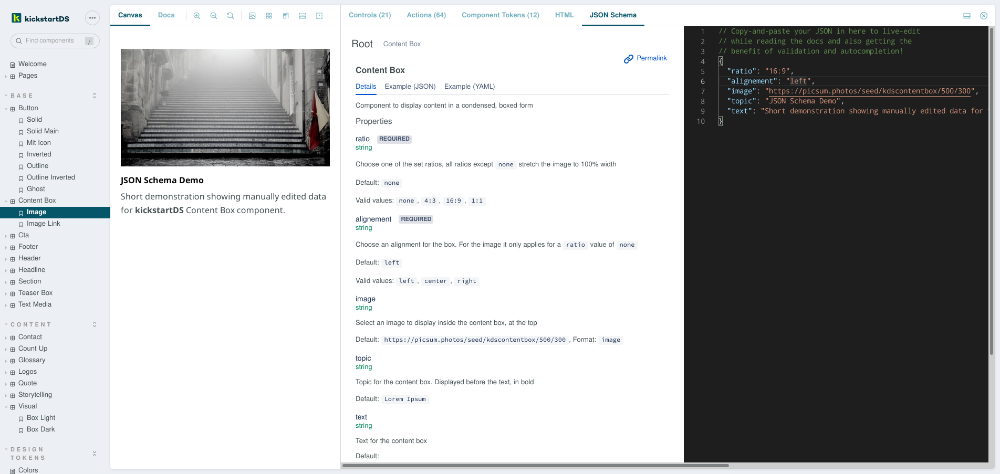

# Storybook JSON Schema Addon

Displays associated JSON Schema documentation using a rich `JSON Schema Explorer` interface, and adds a validating JSON Code Editor with semantic auto-complete to interact with your components, and copy configurations with ease.

`JSON Schema Explorer` is based on the excellent [Atlassian JSON Schema Viewer](https://github.com/atlassian-labs/json-schema-viewer).
It was slightly modified to generate bundles that can be imported for partial use, like this addon does.

`JSON Code Editor` is based on [@monaco-editor/react](https://github.com/suren-atoyan/monaco-react). The editor is connected to your story state / args, so changing props through `Controls` is reflected in the code shown. Vice-versa if you edit the JSON, and the result is valid according to the schema, your changed args are applied to the story, too.

**[Show me a working demo](https://www.kickstartds.com)**



**Table of contents:**

- [Storybook JSON Schema Addon](#storybook-json-schema-addon)
  - [What it's for](#what-its-for)
  - [Getting started](#getting-started)
  - [Advanced configuration](#advanced-configuration)
  - [Authors](#authors)

## What it's for

Three things you can use this addon for:  
1. Explore associated JSON Schema documentation, in a nicely organized fashion in the `JSON Schema Explorer`  
2. Configure components through Controls, copy the resulting JSON as a starting point or template for API-usage / data generation purposes in the `JSON Code Editor`  
3. Paste JSON to validate data or preview component state in the `JSON Code Editor`  

## Getting started

Prerequesite: Your components need to have JSON Schema files associated with them. Additionally schemas need to be dereferenced already, as $ref-resolution is not (a tested) part of this addon (yet? ... let us know in the issues if you need this).

First step is to install the addon:

```sh
$ yarn add --dev @kickstartds/storybook-addon-jsonschema
```

Second step, register the addon inside your `.storybook/main.js` (just add it to the list):

```javascript
module.exports = {
  addons: ['@kickstartds/storybook-addon-jsonschema']
};
```

Third step, export the schema as [component- or story parameter](https://storybook.js.org/docs/react/writing-stories/parameters):

```javascript
export default {
  title: "Button",
  component: Button,
  parameters: {
    jsonschema: {
      "$schema": "http://json-schema.org/draft-07/schema#",
      "$id": "https://my-components/button.schema.json",
      "type": "object",
      "properties": {
        "primary": {
          "type": "boolean",
          "default": false,
        },
        "label": {
          "type": "string"
        }
      }
    }
  }
};
```

## Advanced configuration

This addon is still early, advanced configuration options will be added at a later date. Feel free to let us know in the issues if something specific is unclear, or doesn't work!

## Authors

This addon was made with 🍋 by the team behind [kickstartDS - the frontend first framework](https://www.kickstartds.com/)!

> kickstartDS is a comprehensive component and pattern library

> We enable web development teams to create consistent and brand compliant web frontends super efficiently. With a built-in Design System to serve all your digital touch points. Easy like squeeeeezing a lemon.

We use the addon to let users of our Design System solution interact with their components through our core JSON Schema property-layer. View our [landing page](https://www.kickstartds.com/) to learn more! 👋


